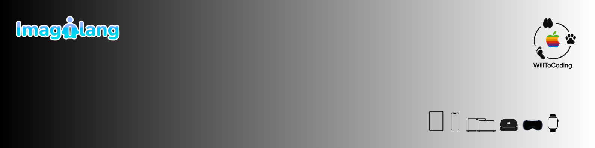

## Sobre mí

iOS Developer en Madrid especializado en el ecosistema Apple. Desarrollo nativo con **Swift 6** y **SwiftUI**, enfocado en **Clean Architecture** y **Strict Concurrency** para aplicaciones multiplataforma: iOS, iPadOS, macOS, watchOS, tvOS y visionOS.

Co-Founder de **Imagilang**, app educativa para aprender idiomas actualmente en beta en App Store.

> *"WillToCoding"* — Inspirado en la filosofía de Nietzsche y la voluntad de poder aplicada al desarrollo de software.

---

## Actualmente

- Explorando **Foundation Models** de Apple para integración de IA on-device
- Escribiendo sobre desarrollo iOS en mi [Newsletter](https://www.linkedin.com/newsletters/willtocoding-7375954117069856768/)

---

## Tech Stack

---

## Proyectos Destacados

| Proyecto | Descripción | Tech |
|----------|-------------|------|
| [**Imagilang**](https://github.com/WillToCoding/Imagilang) | App educativa de aprendizaje de inglés mediante gamificación | Swift, Unity, Firebase |
| [**Ejercicios-iOS**](https://github.com/WillToCoding/Ejercicios-iOS) | 150 ejercicios interactivos de algoritmia en Swift 6 | Swift 6, SwiftUI, MVVM |
| [**MisMangas**](https://github.com/WillToCoding/MisMangas) | App de gestión de colección de mangas | SwiftUI, SwiftData |

---

## Experiencia

**Co-Founder & Full Stack Developer** · Imagilang · `sept. 2024 - dic. 2025`

**Unity Developer** · Haier · `mar. 2025 - jun. 2025`

---

## Formación

**Apple Coding Academy** · Swift Developer Program 2025

**MEDAC** · DAM (Desarrollo de Aplicaciones Multiplataforma)

---

