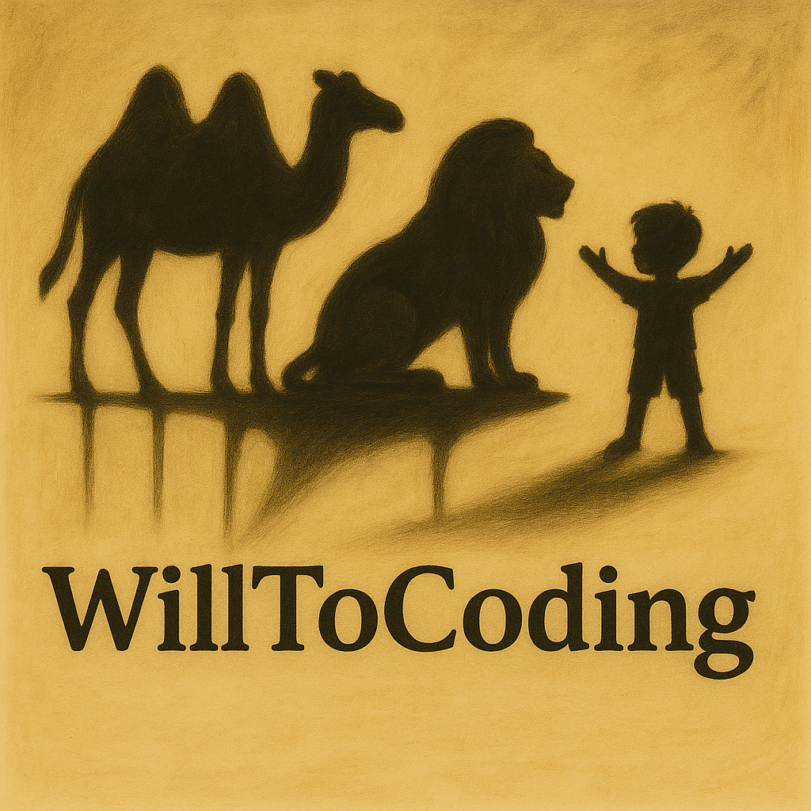

# Hola, mi nombre es **Juan Carlos Morán** 👋
### iOS Developer

🔸 Apasionado por crear apps que unen tecnología y experiencia de usuario.  
🔸 Foco en **iOS, Swift y el ecosistema Apple**, explorando también **IA y accesibilidad**.  
🔸 La metáfora de mi camino como dev: **camello → león → niño**  
  - 🐫 Aprendiendo las bases de Swift y el entorno Apple.  
  - 🦁 Rompiendo la dependencia de tutoriales para crear mis propias soluciones.  
  - 👶 Jugando con libertad para innovar y transformar ideas en apps reales.  

---

## 🚀 Sobre mí
- 📱 Actualmente desarrollando proyectos en **iOS con Swift**.  
- 📚 Siempre aprendiendo nuevas tecnologías y frameworks.  
- 🤝 Abierto a colaborar en apps creativas y proyectos open source.  

---

## 🌐 Encuéntrame en:
- [LinkedIn](https://www.linkedin.com/in/juancarlosmoránmartín)  

---

<!--
**WillToCoding/WillToCoding** is a ✨ _special_ ✨ repository because its `README.md` (this file) appears on your GitHub profile.

Here are some ideas to get you started:

- 🔭 I’m currently working on ...
- 🌱 I’m currently learning ...
- 👯 I’m looking to collaborate on ...
- 🤔 I’m looking for help with ...
- 💬 Ask me about ...
- 📫 How to reach me: ...
- 😄 Pronouns: ...
- ⚡ Fun fact: ...
-->
